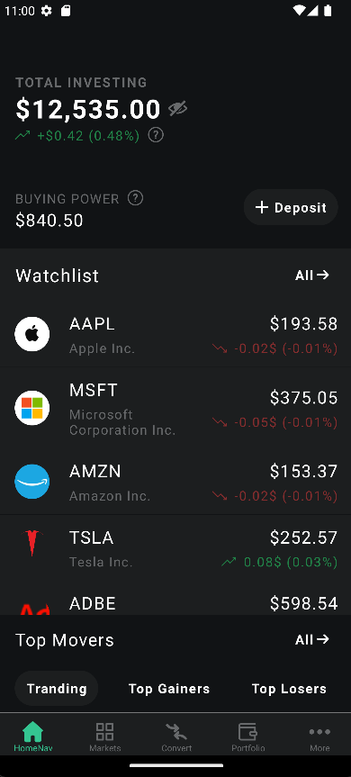

# Polygon App

El proyecto consiste en el desarrollo de una aplicación móvil utilizando React Native y un backend basado en NodeJS con ExpressJS. La aplicación obtendrá datos de la API Polygon para mostrar información sobre estados de carga y variaciones de precios en acciones

## Tabla de Contenidos

- [Características](#características)
- [Capturas de Pantalla](#capturas-de-pantalla)
- [Instalación](#instalación)
- [Uso](#uso)
- [Configuración](#configuración)
- [Contribución](#contribución)
- [Licencia](#licencia)

## Características

  - Visualización de información sobre la variación de precios de acciones.
  - Watchlist personalizada.
  - Actualización de datos con gesto de arrastrar hacia abajo.

## Capturas de Pantalla



## Instalación y ejecucion

Para este proyecto se uso Node V21.0.0 y se desarrollo con Expo y TypeScript para manajar correctamente los tipos
Nota: En el caso de Android es recomendable en la version 33 
```bash
# Intalacion de las dependencias
npm install

# Ejecicion sobre las plataformas
npm run android
npm run ios
